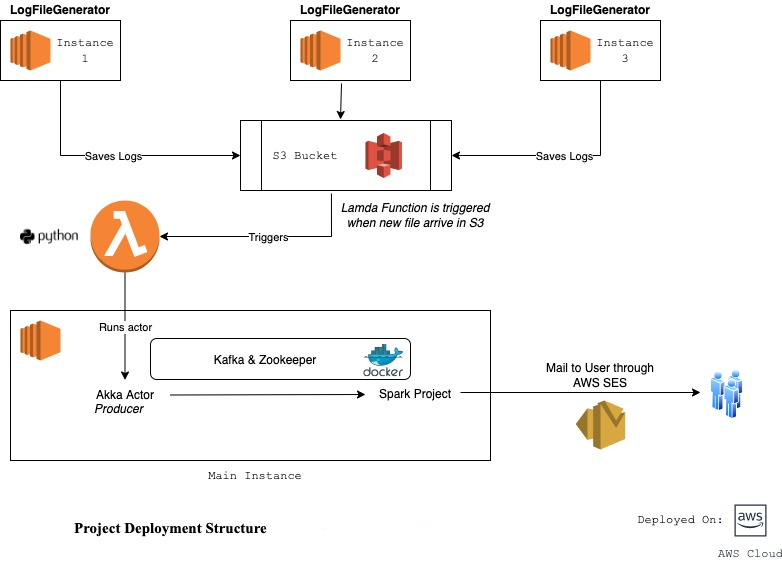
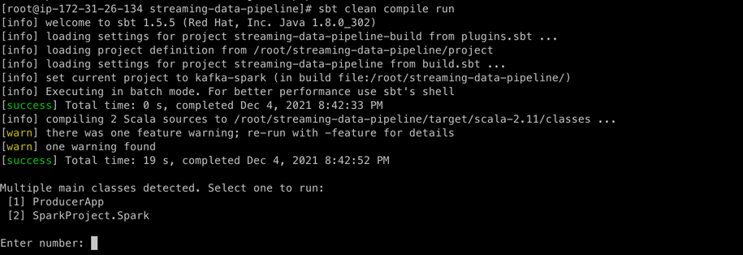
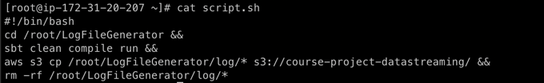

# Akka-Kafka-Spark Data Pipeline

## Project Description
The intention of the project is to create a streaming data pipeline. 
The logs generated over multiple EC2 instances are pushed to S3 bucket which trigger a Lambda function thereby interacting with Akka Actor System to fetch the newly generated log file and transmit it to the Spark Program through Kafka messaging system.

	
## Project Structure


This project can be divided into 4 major parts.
1. Setup LogFileGenerator in multiple EC2 instance and update the log files in S3 bucket periodically.
2. Create AWS Lambda function to  trigger akka actor whenever new logs arrive.
3. Set up a Spark project for further processing of the logs message and to trigger the mail.

## Running the Project

### Steps to set up the environment. 

#### Java 8 & sbt
* Download and install Java 8 on your local system. 
* Download and install sbt to compile and run the project. 

#### Kafka & Zookeeper
* Download and install Docker on local system. Download link can be found on the following link - https://docs.docker.com/desktop/windows/install/
* Start the local docker server.
* Install the [kafka-zookeeper](https://hub.docker.com/r/johnnypark/kafka-zookeeper/) image by jonnyparka by using the following command.
```
docker pull johnnypark/kafka-zookeeper
```
* Run the following command to start Zookeeper server and Kafka Server
```
docker run -p 2181:2181 -p 9092:9092 -e ADVERTISED_HOST=127.0.0.1  -e NUM_PARTITIONS=10 johnnypark/kafka-zookeeper
```
* The Kafka & zookeeper should be running in your system on port 9092 and 2181 respectively. 

#### Apache Spark

* Please install and setup Apache spark in local system. 
* The following [link](https://medium.com/i-want-to-be-the-very-best/installing-apache-spark-on-windows-10-ce1c45de35ab) can be followed to achieve the same. 

Once the pre-requisite setup is completed, to compile and run the application, follow the following steps. 

```
Note: 
The sample log file present in src/main/resources/sampleLogfile.txt directory can be used a input to the application.

Please change the location of input in application.conf (emailservice.source-log-file parameter).
```

#### Project Setup

1. Please clone this repository on your system by running the following command. 
```
git clone https://github.com/ameykasbe/streaming-data-pipeline.git
```
2. Navigate to the cloned repository and run the following command to compile and build the project. 
```
sbt clean compile
```

#### Run Apache Spark:

1. Please update the output directory location for the spark report to be generated.(Please give absolute path)
2. Go the root directory of your project.
3. Execute `sbt clean compile assembly` which will build a fat jar that will be used to run the spark job.
4. From root folder, navigate to `target/scala-2.11` folder
5. Execute the command `spark-submit --class SparkProject.Spark <name of your jar file>` to start the spark cluster and keep it running as long as kafka is streaming data.

#### Run Akka Actor.

1. Go the root directory of your project.
2. Execute the following command to compile and run the application.
```
sbt clean compile run
```
3. Once compiled, please choose `[1] ProducerApp`, to start the execution of actor. 


## Deployment on Cloud

### Create IAM role for EC2
* Navigate to Amazon AWS IAM service.
* Click on Roles (left panel)
* Click on "Create role"
* Select EC2 as service
* Add permissions - AmazonSSMManagedInstanceCore
* Give the role a name - e.g. ec2-command-lambda-ssm

### Create EC2 instance
* Create an EC2 instance.
  1. Navigate to AWS EC2
  2. Click on Launch instance
      1. Select "Amazon Linux 2 AMI (HVM), SSD Volume Type"
      2. Download the key-pair in the process
* Attach the created IAM role to the instance
    1. Navigate to EC2 instance
    2. Click on actions -> Security -> Modify IAM roles
    3. Select the newly created role
    4. Click on save with the created IAM role.


### [Amazon S3](https://aws.amazon.com/s3/)
* Amazon Simple Storage Service (Amazon S3) is an object storage service.
* The log files generated from the log generators running on the three EC2 instances are stored is S3 buckets.
* As soon as a file is inserted into S3 bucket, lambda function is triggered which in turn triggers (Setup and detailed explanation below).

### LogFileGenerator

Updated LogFileGenerator Forked Repository - https://github.com/samihann/LogFileGenerator.git
* LogFileGenerator is deployed on three EC2 instance which are sequentially updating the logs to the S3 bucket.
* The LogFileGenerator  for each instance should be periodically running in EC2 instance at designated time and keep on appending the logs
  to messages a single log file. And the updated log file should be placed in S3 bucket from where the Lambda Function can access it.

* To achieve this functionality there are few changes made to LogFileGenerator logback.xml file. Updated code can be accessed in the
  forked repository mentioned above.

#### Cron

* To run the project periodically in the linux instance, Cron is utilized.
* All the terminal commands required to run the application are put in a shell script.
* At the designated time, the cron will execute the shell script and run the application.



* Please refer file to see the shell script. -> [LogUploadScript.sh](/Shell-Scripts/LogUploadScript.sh)
* AWS CLI is used to copy the updated log file to S3 bucket where the lambda function can access it.
* Please refer below to see the crontab entry.
* 


* At 20/40/60 mins of every hour , the [LogUploadScript.sh](/Shell-Scripts/LogUploadScript.sh) will be executed which will add logs messages to S3 in one of the 3 instances.
* As it can be seen from the cron logs, the file is being executed every day
  


### [Lambda Function](https://aws.amazon.com/lambda/)
* Lambda function is a serverless compute service which can be triggered by some events.

### Algorithm
* Python module boto3 is used to create, configure, and manage AWS services, such as Amazon EC2 and Amazon S3 with the help of [AWS Systems Manager Agent](https://docs.aws.amazon.com/systems-manager/latest/userguide/ssm-agent.html). 
* An SSM client is created. The created file's information including it's name is extracted from the event trigger. 
* Configurations of the EC2 instance is present in `application.conf` like AWS EC2 instance id and the name of the shell script to be triggered in it.0 
* With the help of ssm client, the shell script present in the EC2 instance is triggered using the `AWS-RunShellScript` document.

### Create IAM role for Lambda
* Navigate to Amazon AWS IAM service.
* Click on Roles (left panel)
* Click on "Create role"
* Select Lambda as service
* Add permissions - AWSLambdaExecute, AmazonEC2ReadOnlyAccess, AmazonSSMFullAccess, AWSLambdaBasicExecutionRole-a8596e69-23fd-4654-8d64-c3ac96a18d0d, AWSLambdaS3ExecutionRole-922ed441-aeae-4f32-9c69-a1b251e1aa3e
* Give the role a name - e.g. lambda-ssm

#### Setup AWS Lambda
1. Setup AWS Lambda function
    1. Navigate to AWS Lambda
    2. Create Function
        1. Select from scratch
            1. Enter name
            2. Select Python as language
            3. Enter the code from `lambda/lambda.py`
            4. Deploy
    3. Setup IAM role - Click on Configuration -> Execution role -> Edit. Add the IAM role created above.
    4. Increase timeout - Configuration -> General config -> Change timeout to 1 min
2. Setup Lambda configuration
    1. Add a JSON file with the configuration from `lambda/application.json` file.
    2. Make appropriate changes according to your AWS instance and shell script name.


#### Setup Lambda Trigger
* Under Lambda > Functions > <your_lambda_function.py>, click on "Add Trigger", select trigger - "S3"
* Select your S3 bucket.
* Select "All object create events" as Event type.

* Now, whenever there is any object creation in the specified S3 bucket, lambda function will be triggered in the specified EC2 instance.


## [Kafka](https://kafka.apache.org/)
* Apache Kafka is an open source, distributed streaming platform that allows for the development of real-time event-driven applications.
* It allows developers to make applications that continuously produce and consume streams of data records.

### How does Kafka helps in messaging system


* When companies start with implementing microservices the architecture is simple but after a while, it gets really complicated.

#### Problems
* If you have 4 source systems, and 6 target systems, you need to write, 24 integrations. 
* Each integration comes with difficulties around  
  * Protocol — how the data is transported (TCP, HTTP, REST, FTP,JDBC...) 
  * Data format — how the data is parsed (Binary, ) 
  * Data schema & evolution — how the data is shaped and may change 
  * Each source system will have an increased load from the connections
  * Each data pipelines have different requirements
  
### How Kafka helps
  * Kafka provides a messaging system between the services.
  * It follows distributed publish subscribe system, meaning, record is published and multiple consumers can subscribe to them.
  * It helps in decoupling system dependencies. 
    * Reduces the complexity of data pipelines making communication simpler and manageable 
    * Provides a common paradigm without any concern about the platform or languages 
    * Provides asynchronous communication
    * Facilitates reliable communication. Even if receiver not working - messages won't get lost
    
### Kafka Architecture


### Terminologies
* Producer - 
	* The applications that produces messages.
	* Publishes data to a particular topic
* Consumer - 
    * The applications that consumes messages.
    * Producers send messages to kafka, kafka stores the messages, consumer who wants these messages subscribe to receive them. Adding consumer is easy in this way. 
* Broker
	* Single machine in Kafka cluster
* Zookeeper
	* Another Apache open source project
	* Stores the meta-data information related to kafka cluster - broker info, data info etc.
	* Manages the whole kafka cluster.
* Topic
	* Collection of logs of a particular category
	* Segregates messages and consumer will only subscribe to the topics they need
	* Can have 0/1/multiple consumers
		Example - sales topic, product topic
* Partition
	* Topics are divided into partitions
	* Partitioning allow parallel processing in multiple brokers - allows multiple consumers to read from a topic parallely


### Advantages of using Kafka
* Kafka is distributed. It runs as a cluster that can span multiple servers or even multiple data centers.
* The records that are produced are replicated and partitioned in such a way that allows for a high volume of users to use the application simultaneously without any perceptible lag in performance. So, with that, Apache Kafka is super fast.
* It also maintains a very high level of accuracy with the data records,
* Maintains the order of their occurrence
* Because it's replicated, Apache Kafka is also resilient and fault-tolerant.

### Kafka APIs
* Kafka works on 4 core APIs.
  * Producer API
      * The producer API allows your application to produce, to make, these streams of data.
      * It creates the records and produces them to topics. A "topic" is an ordered list of events.
      * Topic can persist to disk that's where it can be saved for just a matter of minutes if it's going to be consumed immediately or you can have it saved for hours, days, or even forever.
  * Consumer API
      * Subscribes to one or more topics and listens and ingests that data.
      * Producers can produce directly to consumers and that works for a simple Kafka application where the data doesn't change
  * Streams API
      * To transform the data we need Streams API
      * Leverages both Producer and Consumer API	
		
  * Connector API
      * Write connectors - reusable producers and consumers
      * In a Kafka cluster many developers might need to integrate the same type of data source, like a MongoDB, for example.
      * Not every single developer should have to write that integration, what the connector API allows is for that integration to get written once, the code is there, and then all the developer needs to do is configure it in order to get that data source into their cluster.

### Kafka Working
* With Kafka, messages are published onto topics.
* These topics are like never-ending log files.
* Producers put their messages onto a topic.
* Consumers drop in at any time, receive messages from the topic, and can even rewind and replay old messages.
* Messages are only deleted from a topic when you want them to be deleted.
* You can even run a Kafka broker that keeps every message ever (set log retention to “forever”), and Kafka will never delete anything.
* One of the best things about Kafka is that it can replicate messages between brokers in the cluster.
* So consumers can keep receiving messages, even if a broker crashes.
* This makes Kafka very capable of handling all sorts of scenarios, from simple point-to-point messaging, to stock price feeds, to processing massive streams of website clicks, and even using Kafka like a database (yes, some people are doing that).

### Kafka in Streaming-data-pipeline project
* Please refer to `ProducerApp.scala`
* Log events are streamed from the static log file to Kafka producer using Akka Streams.
* Kafka producer streams the log events as topic to all of its subscribers, in our case, Spark. 
* Subscriber Spark directly attached to the publisher of this stream will see an individual flow of elements

### Kafka Setup on EC2 Instances

#### Docker
* Docker is a set of platform as a service (PaaS) products that use OS-level virtualization to deliver software in packages called containers.
* To set up Kafka and Zookeeper on EC2 instance and locally, docker is used. 

#### EC2 Instance Setup
* To run the kafka-zookeeper server on EC2 instance `johnnypark/kafka-zookeeper` image is used.
* Docker server is installed and started on EC2 instance. 
* Install the [kafka-zookeeper](https://hub.docker.com/r/johnnypark/kafka-zookeeper/) image by jonnyparka by using the following command.
```
docker pull johnnypark/kafka-zookeeper
```
* Run the following command to start Zookeeper server and Kafka Server
```
docker run -p 2181:2181 -p 9092:9092 -e ADVERTISED_HOST=127.0.0.1  -e NUM_PARTITIONS=10 johnnypark/kafka-zookeeper
```
Zookeeper Status:


### Spark

Spark Streaming is an extension of the core Spark API that allows data engineers and data scientists to process real-time data from various sources including (but not limited to) Kafka, Flume, and Amazon Kinesis. This processed data can be pushed out to file systems, databases, and live dashboards.


#### Execution steps:

1. Fetch data from Kafka Topic for every 60 sec window duration.
2. Take count of log entries which contain log message of type `INFO`, `ERROR`, `WARN` and `DEBUG`.
3. Perform MapReduce on the count calculated in step 2.
4. Save the counts in a report only if the count of ERROR messages exceed 1 in the time window.
5. Trigger an email to the registered users with the generated report.


**Sample Output:**


### AWS Simple Email Service

Amazon Simple Email Service (SES) is a cost-effective, flexible, and scalable email service that enables developers to send mail from within any application. To set up email service on our EC2 instance, we can follow the link from [AWS SES Setup](https://medium.com/swlh/sending-email-from-aws-lambda-and-ec2-d5233aa0ae24).

To trigger the email service after we have generated the report, we trigger `emailservice.sh` from our code which contains the command to zip the report and send it to the registered stakeholder.

**NOTE**: With the zip of the report, another file `noname` gets attached to the mail. This file is created as we have used `uuencode` in our command. The uuencode command converts a file from its binary form into a 7-bit ASCII set of text characters. It is used for email clients that do not support MIME (Multipurpose Internet Mail Extensions).
It may leave the ascii file as  "noname" or "unnamed"

**Sample Mail Recieved:**


## Testing

To run the test cases for the following project, please run the following command
```
sbt test
```


## References
1. Dr. Grechanik, Mark, (2020) Cloud Computing: Theory and Practice.
2. [Kafka](https://kafka.apache.org/)
3. [TutorialWorks](https://www.tutorialworks.com/kafka-vs-streams-vs-connect/)
4. [Edureka](https://www.youtube.com/channel/UCkw4JCwteGrDHIsyIIKo4tQ)

